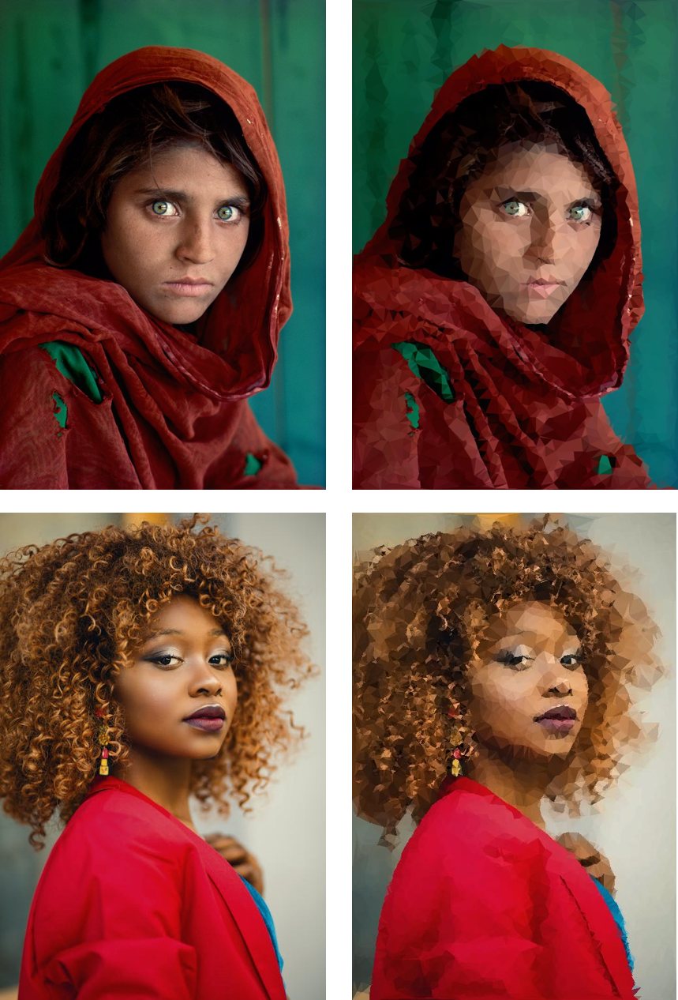

# Image Approximation with Polygons using Delaunay Triangulation

# Features:

- Parametric configuration
- Comparison with other methods and result evaluation through statistical tests and visualization (due to the stochastic nature of the algorithm).
- Automated testing and graph generation with fixed seeds for result reproducibility.
- Multiprocessing
- Denoising and edge detection

# Libraries

Software built using the most popular libraries in the field of Data Science:

### Algoritmos evolutivos

- [DEAP] - Provides basic functionalities for instantiating evolutionary algorithm problems.
- [multiprocessing] - Parallelization in fitness calculation (master-slave architecture)

### Image Processing

- [OpenCV] - For denoising and edge detection algorithms.
- [PILLOW] - For dynamically generating and modifying images (genotype and phenotype of individuals).
- [NumPy] - Simplifies linear algebra operations using C code for increased efficiency.

### Analysis of Results

- [SciPy] - Evaluation. Statistical tests with obtained results.
- [scikit_posthocs] - Results analysis with normal distribution using pairwise tests.
- [Pandas] - Data manipulation.
- [Matplotlib] - Data visualization.

# Results

